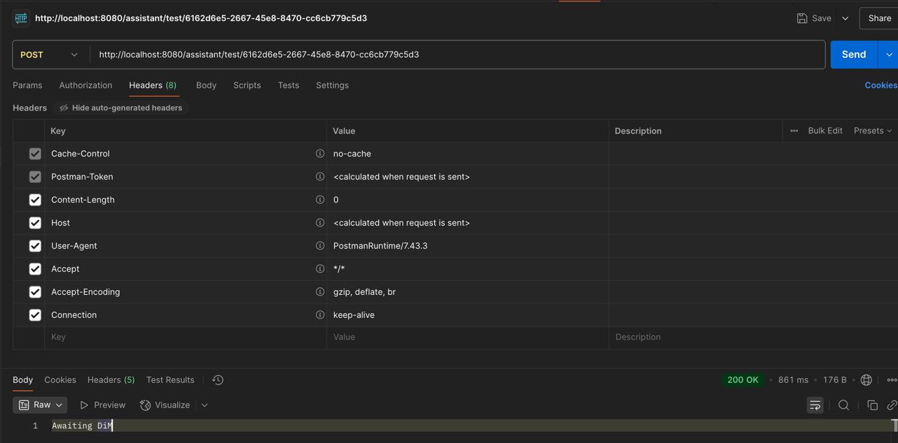
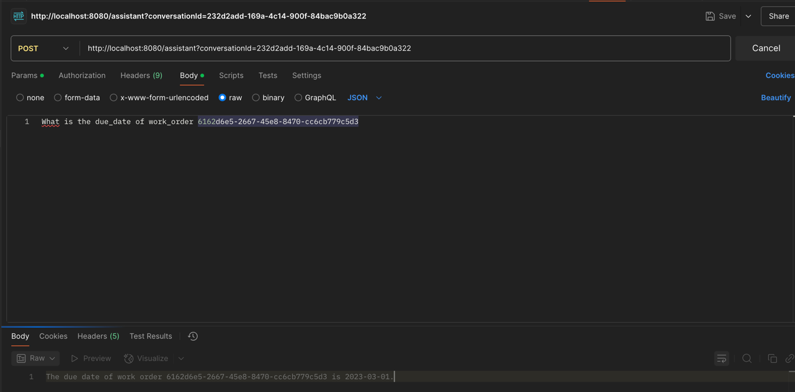
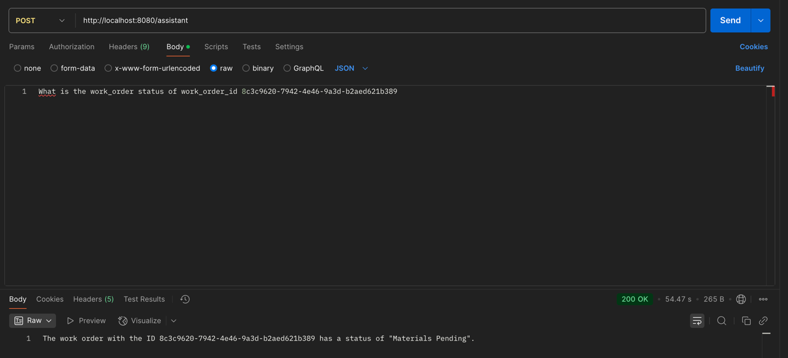

# Duplo-Assistant

## Overview
Duplo-Assistant is an AI-powered assistant designed to help users interact with Duplo data using natural language queries. It leverages large language models (LLMs) to translate user questions into actionable insights.

## Description
This project enables users to query operational, asset, and configuration data using simple English. The assistant processes queries, interacts with the backend data sources, and returns relevant results. It is ideal for teams to automate data retrieval and reporting tasks.

## Pre-requisites
- [Ollama](https://ollama.com/) (for running LLMs locally)
- Supported LLM models:
    - [CodeLlama](https://ollama.com/library/codellama)
    - [Llama3.2](https://ollama.com/library/llama3.2)
    - [SQLCoder](https://ollama.com/library/sqlcoder)
- [MongoDB Compass](https://www.mongodb.com/try/download/compass) (for database management)
- Java 17
- Python 3.8 or higher
- Gradle (for building the Java backend)

## Technology Stack
- Java (Spring Boot)
- Python
- Gradle
- MongoDB
- Ollama (LLM serving)

## How to get started

1. **Clone the repository**
   ```sh
   git clone <repository-url>
   cd duplo-assistant

2. **Set up the backend**

- Ensure Java and Gradle are installed.
- Build and run the Spring Boot application:
   ```sh 
   ./gradlew bootRun
   


3. **Set up the database**

- Install MongoDB and MongoDB Compass.
- Import the required data into your MongoDB instance.
- Install Ollama and pull the required models:
    ```sh
    ollama pull codellama
    ollama pull llama3.2
    ollama pull sqlcoder
    ```

4. **Start querying**
- Once the backend is running, you can access the assistant via the provided UI or API endpoints.

5. **Example Queries**
- Operational data: "What is the current status of workorder id X?"

- Example using \`curl\` to execute a query:

```sh
curl -X POST http://localhost:8080/assistant
  -H "Content-Type: application/json" \
  -d '{"query": "What is the current status of work order id X?"}'
```

1. **Test query:**



2. **Natural Language query to LLM:**




